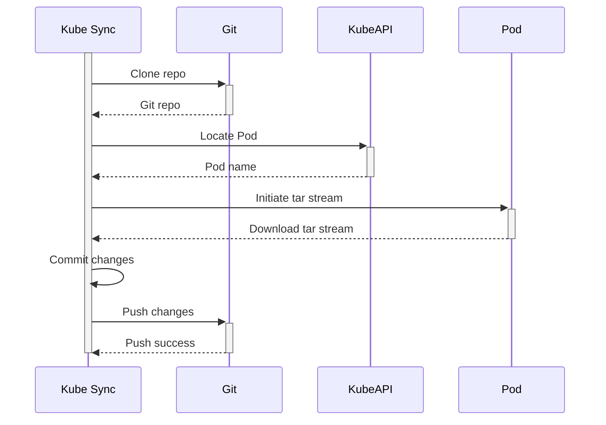

# Kube Sync
Kube Sync is a simple service that copies data from a target Pod, then commits and pushes to a target GIT repository.

## Targeted Use Cases
The initial use case was focussed on [Home Assistant](https://artifacthub.io/packages/helm/k8s-at-home/home-assistant) and [Zibgee2Mqtt](https://artifacthub.io/packages/helm/k8s-at-home/zigbee2mqtt) which run on my K3s setup. I wanted a consistent mechanism to backup and version control changes.

## Design

### High Level Sequence

# Known Gaps/Issues
1. Only tested with AT token access to GitHub
2. Does not currently use secrets for tokens, should be a very simple migration
3. Isolate to specific role and user

## References
- Solution uses the Kube Copy operations in Kubectl - https://github.com/kubernetes/kubectl/blob/master/pkg/cmd/cp/cp.go
- Leverages the "Go-Git" library for Git integration - https://github.com/go-git/go-git
